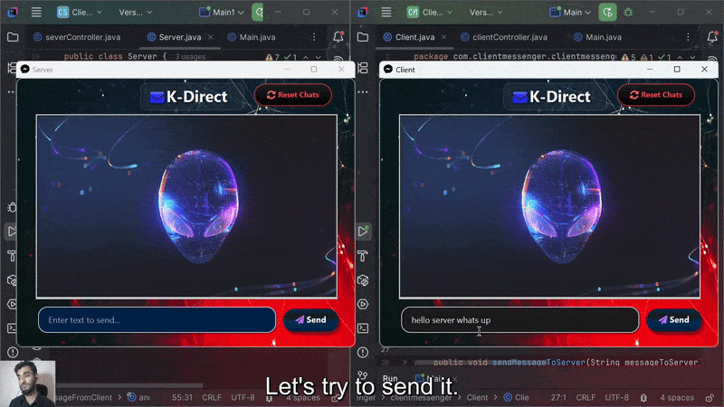

## 🎬 Preview (Turn On Audio) 🔊

> **🔹 Small Preview of Application Features**   
> **🚨Important Note:** **🔊 Turn On Audio**

[](https://youtu.be/pWCBKj11iqs?si=_KNlJyFnfraoIEgl)


[🔗 View App Preview](https://github.com/user-attachments/assets/3188cfb9-d9d7-49e9-b617-6aa5ac6a6ede)

### 🔹 ## 📽️ SafexBank Demo (Click to Play GIF)



---

# 📱 K-Direct

K-Direct is a feature-rich desktop chat application built with **JavaFX**. It offers real-time messaging, a modern and clean UI, and a smooth user experience. This project highlights core Java skills with an emphasis on networking and interactive design.

---

## 🚀 Features

- **Real-Time Messaging** – Instant message exchange using client-server communication.
- **Reset & Clear UI** – Quickly reset chats and UI states.
- **Chat Wrapping** – Chat bubbles adjust for long text without breaking layout.

---

## 🛠️ Technologies Used

- **Language**: Java  
- **UI Framework**: JavaFX  
- **Architecture**: MVVM (Model-View-ViewModel)  
- **Networking**: Java Sockets (Client-Server model)  
- **Build Tool**: Maven (for JavaFX, FontAwesomeFX dependencies)

---

## 💻 Prerequisites

Ensure the following tools are installed on your system:

- **JDK 11 or higher**
- **Maven**
- **Git**

---

## ⚙️ Setup Instructions

### 1. Clone the repository
```bash
git clone https://github.com/Kaif-Nazir/K-Direct.git
cd K-Direct
